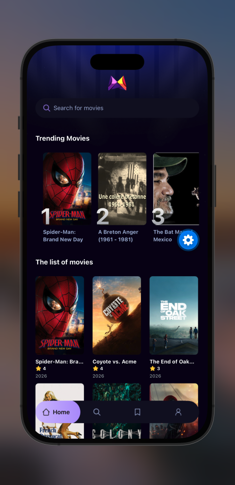

# RN Movie

<div align="center">
  
  
  
  
</div>

<p align="center">
  
</p>

<h3 align="center">Discover movies in a cinematic, modern mobile experience.</h3>

<p align="center">
  RN Movie is a premium movie discovery app built with React Native and Expo, combining a sleek interface, real-time TMDB data, and Appwrite-powered trending insights to help users explore movies faster and more intuitively.
</p>

## Overview

RN Movie brings together modern UI design, responsive mobile interactions, and a clean information architecture to create a polished movie browsing experience. The app surfaces trending titles, enables instant search, and provides a fast, elegant way to discover what’s popular and worth watching next.

## Features

- Browse a curated list of popular movies
- Search for films by title in real time
- View trending titles powered by Appwrite analytics
- Smooth, immersive movie-card interface with NativeWind styling
- File-based navigation using Expo Router
- Support for iOS, Android, and web builds via Expo
- Lightweight app architecture with modular services and reusable UI components

## Tech Stack

- React Native
- Expo SDK
- Expo Router
- TypeScript
- NativeWind
- TMDB API
- Appwrite
- React Native Appwrite SDK

## Project Structure

```text
rn-movie/
├── app.json
├── babel.config.js
├── global.css
├── metro.config.js
├── package.json
├── README.md
├── tailwind.config.js
├── tsconfig.json
├── assets/
│   ├── icons/
│   └── images/
├── interfaces/
│   └── interfaces.d.ts
├── src/
│   ├── app/
│   │   ├── _layout.tsx
│   │   ├── (tabs)/
│   │   │   ├── _layout.tsx
│   │   │   ├── index.tsx
│   │   │   ├── profile.tsx
│   │   │   ├── saved.tsx
│   │   │   └── search.tsx
│   │   └── movies/
│   │       └── [id].tsx
│   ├── components/
│   │   ├── MovieCard.tsx
│   │   ├── SearchBar.tsx
│   │   └── TrendingCard.tsx
│   ├── constants/
│   │   ├── icons.ts
│   │   └── images.ts
│   ├── services/
│   │   ├── api.ts
│   │   ├── appwrite.ts
│   │   └── useFetch.ts
│   ├── fonts/
│   └── types/
│       └── images.d.ts
└── ...
```

## Screens and App Flow

- Home: Displays popular movie listings and trending titles
- Search: Lets users look up movies dynamically and trigger search analytics
- Saved: Placeholder content for personal watchlist or favorite movies
- Profile: User profile area for future personalization
- Movie Detail: Dedicated detail route for individual movie information

## External Services

### TMDB

The app fetches movie data from The Movie Database (TMDB), including discovery and search results.

### Appwrite

Appwrite is used to track search activity and identify trending movies based on user interaction counts. This gives the app a lightweight analytics layer without adding a heavy backend stack.

## Prerequisites

Before running the project locally, ensure you have:

- Node.js 18+
- npm or yarn
- Expo CLI
- A TMDB API key
- An Appwrite project and database configured for trending search tracking

## Installation

1. Clone the repository

```bash
git clone <repository-url>
cd rn-movie
```

2. Install dependencies

```bash
npm install
```

3. Configure environment variables

Create a `.env` file in the project root and add the following variables:

```env
EXPO_PUBLIC_MOVIE_API=your_tmdb_api_key
EXPO_PUBLIC_APPWRITE_PROJECT_ID=your_appwrite_project_id
EXPO_PUBLIC_APPWRITE_DATABASE_ID=your_appwrite_database_id
EXPO_PUBLIC_APPWRITE_COLLECTION_ID=your_appwrite_collection_id
```

4. Start the app

```bash
npx expo start
```

5. Run on a platform

```bash
npx expo start --android
npx expo start --ios
npx expo start --web
```

## Available Scripts

```bash
npm start
npm run android
npm run ios
npm run web
npm run lint
```

## Appwrite Notes

To support trending movie logic, your Appwrite collection should include documents with fields like:

- `movie_id`
- `title`
- `searchTerm`
- `count`
- `poster_url`

The project tracks search activity and increments counts when users search for existing movie entries, which enables a trending movie list.

## Development Notes

This application is built to be clean, scalable, and easy to extend. The service layer is separated into API clients and utility hooks, which keeps the codebase maintainable as features grow.

## Future Enhancements

- Movie detail page enrichment
- Favorites and watchlist persistence
- User authentication
- Personalized recommendations
- Offline support and caching
- Advanced filtering and sorting

## License

This project is licensed under the MIT License. See the LICENSE file for details.

## Contributing

Contributions are welcome. If you want to improve the app, feel free to open a pull request with a clear summary of the changes and testing details.

## Contact

For questions or collaboration opportunities, reach out through the repository owner or project maintainer.
